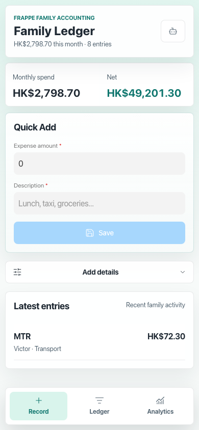
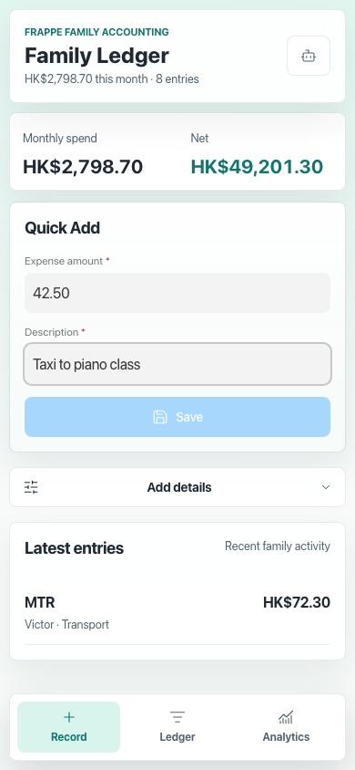
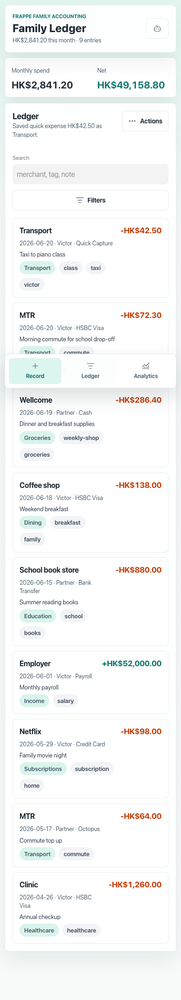
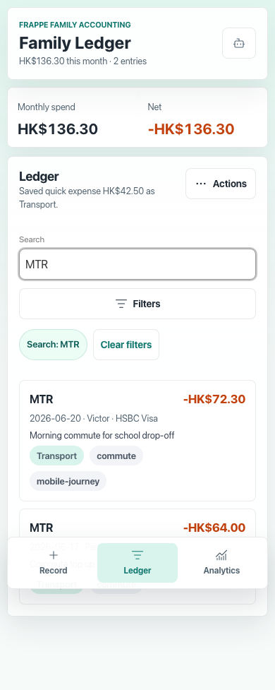
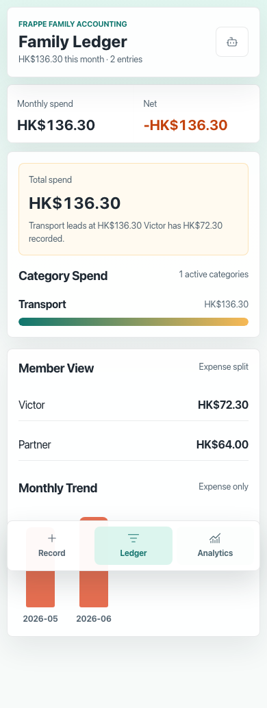
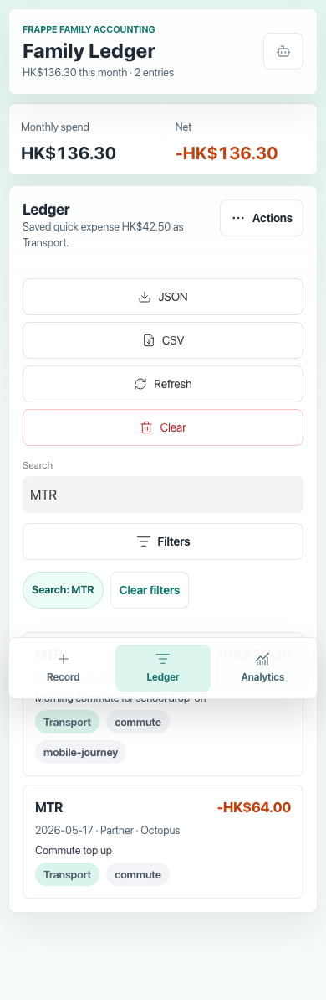
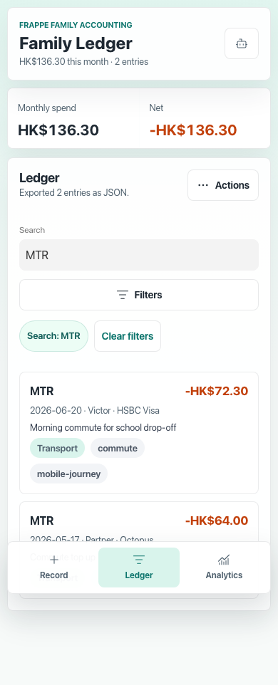
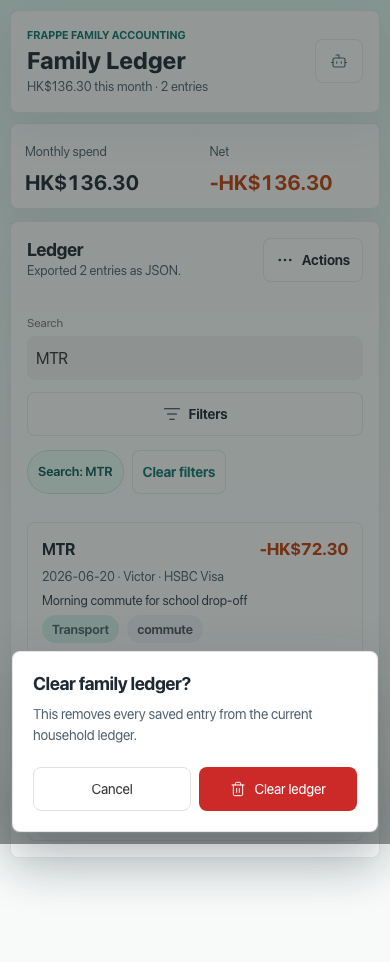
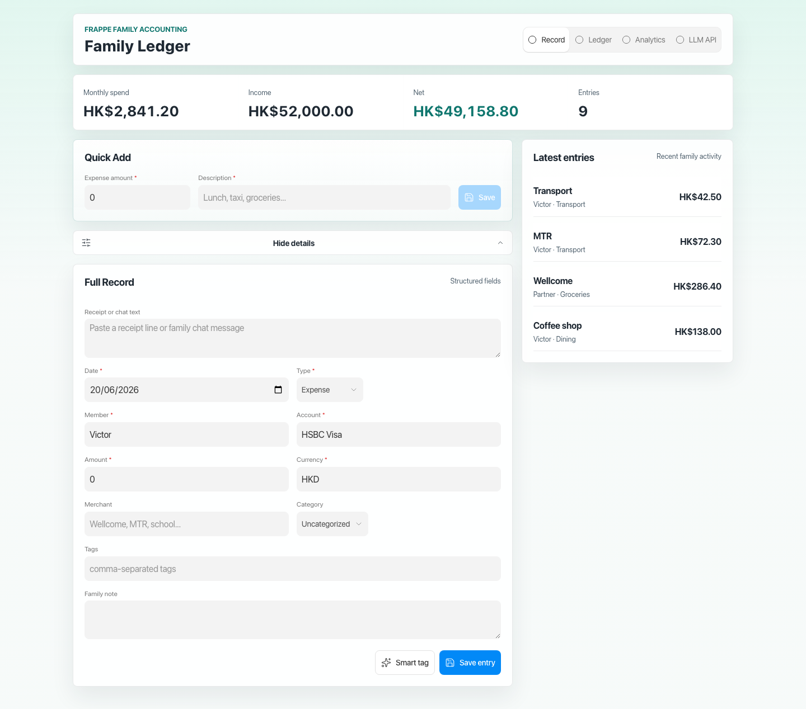

# User Journey Screenshots

Captured from the real local Frappe site at `http://127.0.0.1:8000/family-ledger` using the `arbor.test` site and seeded DocType data in MariaDB.

The mobile journey starts from 8 seeded family ledger entries, records one new quick expense, and leaves the local site with 9 entries.

## Mobile Journey

1. Quick Add first screen

   

2. Quick Add filled before save

   

3. Saved entry visible in Ledger

   

4. Search-first Ledger view

   

5. Analytics insight and charts

   

6. Secondary action menu

   

7. Export completed feedback

   

8. App-level clear confirmation

   

## Desktop Check

## Legacy Baseline

The earlier desktop verification screenshots are kept for comparison:

- `01-record-empty.png`
- `02-minimal-filled.png`
- `03-ledger-after-save.png`
- `04-exported-json.png`
- `05-analytics.png`
- `06-cleared.png`
